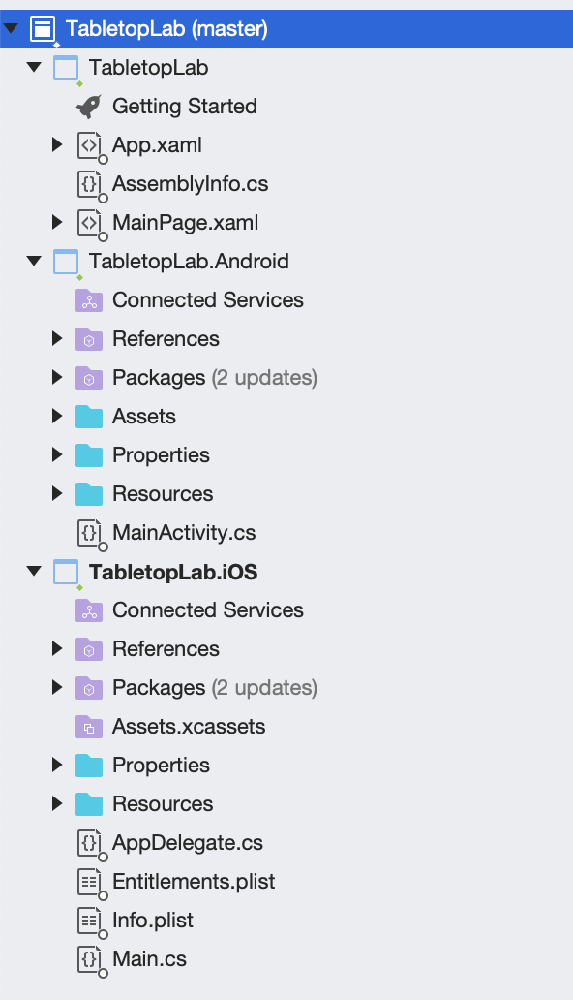

## Tabletop lab

> **Summary**: In this lab, you will build an app to show a 3D city on a table. Using your phone, you'll be able to move around to see the scene from different angles.

**Contents**

1. [Background](#background)
2. [Create the app](#create-the-app)
3. [Display the scene](#display-the-scene)
4. [Set clipping distance](#set-clipping-distance)
5. [Set translation factor](#set-translation-factor)
6. [Set origin camera](#set-origin-camera)

**Requirements**

To be successful with this lab, you'll need:

* A recent iOS device or a recent Android device on [Google's list of supported devices](https://developers.google.com/ar/discover/supported-devices).
  * If deploying to iOS, a Mac set up for Xamarin development
* Visual Studio 2019, for Mac or Windows

## Background

There are three common patterns for AR:

* **Flyover** - the camera feed isn't shown; this is an immersive experience similar to traditional virtual reality (VR).
* **Tabletop** - scene content is pinned to a real-world surface. This simulates placing a 3D printed physical model of the scene on a surface.
* **World-scale** - scene content is rendered and displayed on top of the camera feed. The virtual camera's position is at the same position as the physical camera, so scene content appears as it would if it were physically visible.

In this tutorial, you will build an app that let's you tap a real-world surface (such as a desk or table) to virtually place a scene on that surface. This is an example of the tabletop AR pattern.

## Create the app

> **Note**: You can skip this step if using one of the starter projects. This section goes through all the steps needed to set up a working AR app from scratch, like requesting camera & location permissions.

### 1 - Create a new project

First, create a new Xamarin.Forms project with Visual Studio. On VS for Mac, choose the 'Blank Forms App' template.

When you're done, you should see something like the following:



Next, update **App.xaml.cs** to initialize ArcGIS Runtime before creating the main page:

```cs
// Initialize the ArcGIS Runtime before any components are created.
Esri.ArcGISRuntime.ArcGISRuntimeEnvironment.Initialize();

// The root page of your application
MainPage = new MainPage();
```

There will be an error because the Esri packages haven't been referenced yet. That is fixed in the next step.

### 2 - Install the toolkit

Next, install the AR Toolkit. For .NET, you need to add a reference to the Nuget packages to each of the applicable projects.

<details><summary>New to forms?</summary><p>

> When writing Xamarin.Forms apps, your solution will be split into several projects. One project will include shared code (appears as **TabletopLab** in the image above). The other projects are specific to individual platforms you target, in this case iOS and Android. You can never run the shared code project directly - the platform-specific projects contain the infrastructure needed to run a Xamarin.Forms app.

</p></details>

To install the correct Nuget packages, right-click the solution (top-level node in the Solution Explorer), and select **Manage Nuget packages for Solution**. Search for 'ArcGIS AR' and select **Esri.ArcGISRuntime.ARToolkit.Forms**. Select each project then click 'Install'.

The AR Toolkit Nuget package will automatically install additional dependencies, including the base ArcGIS Runtime, as needed.

### 3 - Add the AR view to the layout

Due to a bug in Xamarin.Forms, AR can't be used on the first page of the application. To work around this, the AR view will be shown on a separate page.

> **NOTE**: This step is done for you already if you used the starter project or the templates.

First, create a new Xamarin.Forms page, called **ARPage** in the same directory as **MainPage.xaml**. On Visual Studio for Windows, be sure to use the **Content Page** template in the 'Xamarin.Forms' section.

Next, update **MainPage.xaml** to show a button:

```xml
<StackLayout>
    <!-- Place new controls here -->
    <Label Text="Welcome to Xamarin.Forms!" HorizontalOptions="Center" VerticalOptions="CenterAndExpand" />
    <Button Text="Start tabletop AR" Clicked="Button_Clicked" />
</StackLayout>
```

In **MainPage.xaml.cs**, add the following code to navigate to the AR page when the button is clicked:

```cs
private void Button_Clicked(object sender, EventArgs e)
{
    Navigation.PushAsync(new ARPage());
}
```

Finally, in **ARPage.xaml**, add an AR scene view to the app. Replace the existing `StackLayout` with the following:

```xml
<Grid>
    <forms:ARSceneView x:Name="MySceneView" />
</Grid>
```

By default, the code above is an error. You can either use the 💡 button to add the `forms` namespace reference automatically (be sure to choose the option that ends with `Forms`), or paste the following after the xmlns:mc declaration:

```xml
xmlns:forms="clr-namespace:Esri.ArcGISRuntime.ARToolkit.Forms;assembly=Esri.ArcGISRuntime.ARToolkit.Forms"
```

### 4 - Set up lifecycle methods

Adding the AR view isn't enough - you need to tell the view to start tracking the environment when the page is shown, and stop when it disappears.

In Xamarin.Forms apps, you need to override `OnAppearing` and `OnDisappearing`. Add the following to **ARPage.xaml.cs**:

```cs
protected override async void OnAppearing()
{
    base.OnAppearing();
    try
    {
        await MySceneView.StartTrackingAsync();
    }
    catch (System.Exception ex)
    {
        DisplayAlert("Error starting AR", ex.Message, "Ok");
    }
}

protected override void OnDisappearing()
{
    base.OnDisappearing();
    MySceneView.StopTrackingAsync();
}
```

### 5 - Configure privacy and manifest declarations

Each platform project needs to be configured specifically to enable AR to work.

1. For Android: add the following to **AndroidManifest.xml** to request permissions and require ARCore:

    ```xml
    <!-- Location service is used for full-scale AR where the current device location is required -->
    <uses-permission android:name="android.permission.ACCESS_FINE_LOCATION" />
    <!-- Both "AR Optional" and "AR Required" apps require CAMERA permission. -->
    <uses-permission android:name="android.permission.CAMERA" />
    <!-- Indicates that app requires ARCore ("AR Required"). Ensures app is only
     visible in the Google Play Store on devices that support ARCore.
     For "AR Optional" apps remove this line. -->
    <uses-feature android:name="android.hardware.camera.ar" android:required="true" />
    <application android:label="TabletopLab">
        <!-- Indicates that app requires ARCore ("AR Required"). Causes Google
         Play Store to download and install ARCore along with the app.
         For an "AR Optional" app, specify "optional" instead of "required".
        -->
        <meta-data android:name="com.google.ar.core" android:value="required" />
    </application>
    ```

2. For iOS: open **Info.plist** in the editor of your choice and add strings for `Privacy - Location When In Use Usage Description` and `Privacy - Camera Usage Description`:

    Privacy notifications:

    ```xml
    <key>NSLocationWhenInUseUsageDescription</key>
    <string>For showing the current location in a map</string>
    <key>NSCameraUsageDescription</key>
    <string>For Augmented Reality</string>
    ```

    To prevent the app from being installed on non-ARKit-compatible apps:

    ```xml
    <key>UIRequiredDeviceCapabilities</key>
    <array>
    <string>arkit</string>
    </array>
    ```

## Enable plane visualization

A good tabletop app will let the user choose where to place the scene. One way to do that is to enable *plane detection* and wait for the user to tap one of the detected planes.

<details><summary>What is plane detection?</summary><p>

ARKit and ARCore both include features to estimate the size and position of surfaces in the real-world. Knowing the position of surfaces is critical for features like tap-to-place. Tapping to place content is a common to many AR apps, including Minecraft Earth and the 'View in your room' feature of the Amazon app.

</p></details>

Detected planes aren't visualized by default, so it can be hard for users to know what can be tapped on. To enable a default visualization for detected planes, update the ARSceneView declaration in **ARPage.xaml** to the following:

```xml
<forms:ARSceneView x:Name="MySceneView" RenderPlanes="True" />
```

When you run the app, you should see something like the following:


Note that it can take a while for ARKit/ARCore to notice surfaces. Keep moving the phone around until you see the dots.

## Implement tap-to-place

Toolkit includes an API, 

## Configure the scene

While any scene can be used in tabletop AR, this lab will use the [San Diego Convention Center web scene](https://www.arcgis.com/home/item.html?id=6bf6d9f17bdd4d33837e25e1cae4e9c9).

Update the 

## Set origin camera

In tabletop AR, the origin camera is the point, in scene coordinates, where the scene is anchored to the physical surface. In most cases, a good origin camera is at the x,y position of the focal point for the scene. To ensure all content is visible and the scene appears to be on top of the table, the vertical position of the origin camera should be at the lowest point in the scene.

For the [San Diego Convention Center scene](https://www.arcgis.com/home/item.html?id=6bf6d9f17bdd4d33837e25e1cae4e9c9), a good origin camera centers on the Manchester Grand Hyatt in San Diego.

> lat: 32.71012, lng: -117.168654, alt: 0

```cs
// code here
```

## Set translation factor

The translation factor determines how far the virtual scene camera moves when the physical camera moves. This value should be set such you can move the phone completely around the scene.

A good formula for finding an appropriate translation factor is: **(virtual content width)/(desired real-world physical width of the scene)**. For example, if you want to show a 1000 meter wide scene on a 1 foot (0.3 meter) table, you would use **1000 / 0.3**, or 3333.33.

For this scene, a translation factor of 700 is appropriate.

```cs
// code here
```

## Set clipping distance

To ensure that the scene looks good on a table, it needs to be limited in extent. Setting a clipping distance will limit what is rendered to a radius around the origin camera.

> **NOTE**: While clipping distance is a great option for limiting the extent of a tabletop scene, you can also specially author data for more precise control. For example, you can choose a rectangular section of a scene and package that with your app.

A clipping distance of 180 will show a circle with a radius of 180, which is appropriate for the translation factor set above.

```cs
// code here
```

## Result

When you run the app, it should look like the following:

